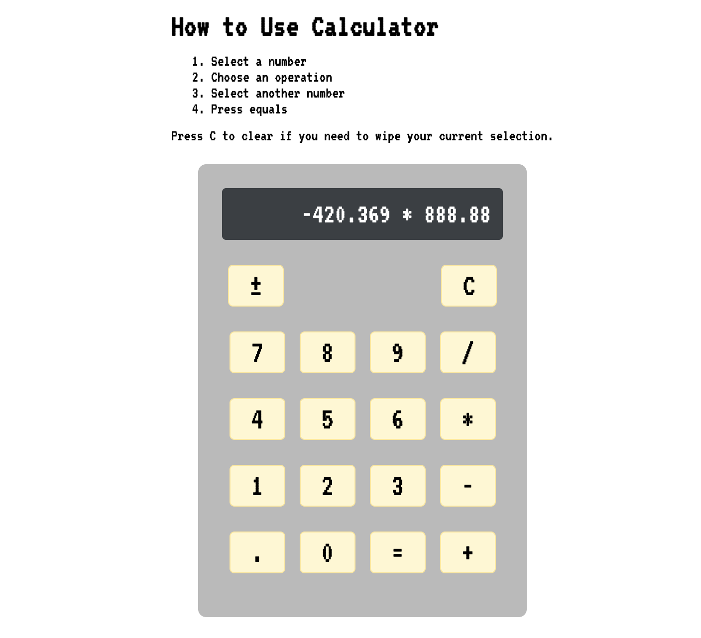

# Description
This is a lab assignment for General Assembly to create a functioning calculator. This calculator takes two multi-digit numbers and displays the result of a mathematical operation.

## Deployment Link
https://shaepy.github.io/dom-events-lab/

## Technologies Used
* HTML
* CSS
* JavaScript

## Level Up Features
1. The calculator accepts multi-digit numbers
4. Plus-Minus feature where you can set negative or positive integers for either number
5. Accepts decimals
2. The recent total is always saved so it can be used as the first number in the next operation
3. Displays the entire operation in the same display until the total

## Edge Cases Covered
* When trying to divide by 0, it will return a message "can't divide by 0" until another button is selected.
* Operator being selected before a number will now default to 0
* Selecting another operator will perform the operation automatically if there’s two numbers already
* If only one number is selected, selecting multiple operators will switch the operator.
* When using the equals(=) sign before a second number is selected, it will keep the first number until an operator and second number is selected, or cleared.

## User Stories (MVP)
* As a user, I want to be able to select numbers so that I can perform operations with them.
* As a user, I want to be able to add two numbers together.
* As a user, I want to be able to subtract one number from another.
* As a user, I want to be able to multiply two numbers together.
* As a user, I want to be able to divide one number by another.
* As a user, I want to be able to see the output of the mathematical operation.
* As a user, I want to be able to clear all operations and start from 0.

## Known Bugs
* FIXED: Pressing clear was not saving the 0 value
* FIXED: Can't divide by zero text was not defaulting to 0 when operator was selected before number

## Further Improvements
Not yet implemented but considering on improving the calculator by:
1. Prevent more than one decimal per number
